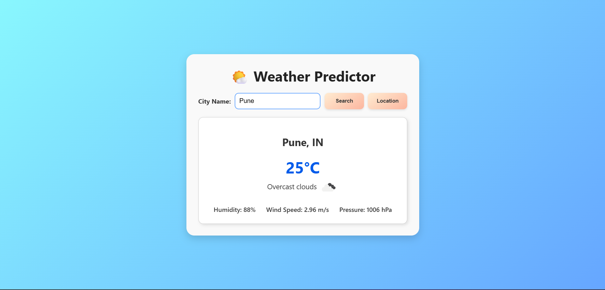

# 🌤️ Weather Predictor

A simple, responsive weather application built with **HTML**, **CSS**, and **JavaScript** that allows users to check real-time weather data for any city or their current location using the OpenWeatherMap API.

## 🚀 Features

- 🔍 Search weather by **city name**
- 📍 Get weather data using **device location**
- 🌡️ Displays temperature, weather condition, humidity, wind speed, and pressure
- 🌐 Responsive and modern UI with clean animations
- 🖼️ Weather condition icons dynamically fetched from OpenWeatherMap

## 🖥️ Demo

[Live Demo](https://youtu.be/i-2d5rovMnQ) 

## 📸 Screenshots

## 🛠️ Tech Stack

- **HTML5** – Structure and layout
- **CSS3** – Styling and responsiveness
- **Vanilla JavaScript** – Dynamic behavior and API integration
- **OpenWeatherMap API** – Weather data and geolocation support

**Note**: You will need to get your own OpenWeather API key (it is free) to actually run the files. I have not displayed my API key for obvious security reasons.
